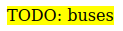

# Highlighting text with pure HTML

To add emphasis to text, as if to highlight it, in HTML, it's possible to use the [`<mark>` tag](https://developer.mozilla.org/en-US/docs/Web/HTML/Element/mark).

```html
<p>
  <mark>TODO: buses</mark>
</p>
```

Result:


