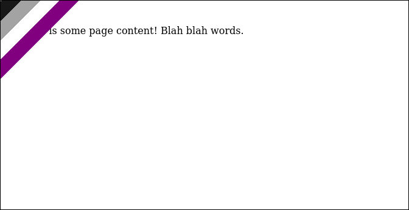

# Add an angled banner in the top left corner of a page

```html
<style>
    .banner {
        height: 90px;
        width: 300px;

        position: absolute;
        top: 0px;
        left: -130px;

        -webkit-transform: rotate(315deg);
        -moz-transform: rotate(315deg);
        transform: rotate(315deg);
    }

    .ace-flag {
        background: linear-gradient(180deg, #181818 25%, #A3A3A3 25%, 50%, #FFFFFF 50%, 75%, #800080 75%);
    }

    .content {
        padding: 2em 2em;
    }
</style>

<body>
    <div class="banner ace-flag"></div>
    <div class="content">
        This is some page content! Blah blah words.
    </div>
</body>
```

Result:



It's possible to place the banner in other corners of the page by changing the `left`, `right` and rotation properties of the `banner` class.

Best used where there's no content in the top right hand corner of the webpage, like on [tdpain.net](https://www.tdpain.net).