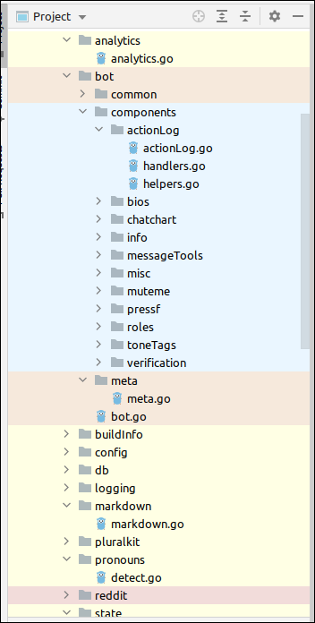

# Scopes in JetBrains IDEs

JetBrains IDEs come with the functionality to group code into so-called scopes. This allows for filtering of source code files and easier navigation.

Scopes can be created by going to `Settings > Appearance & Behaviour > Scopes`, Scopes can be configured based on directories. Once scopes are confiugred, colours can be attached to them from the `File Colors` tab.

